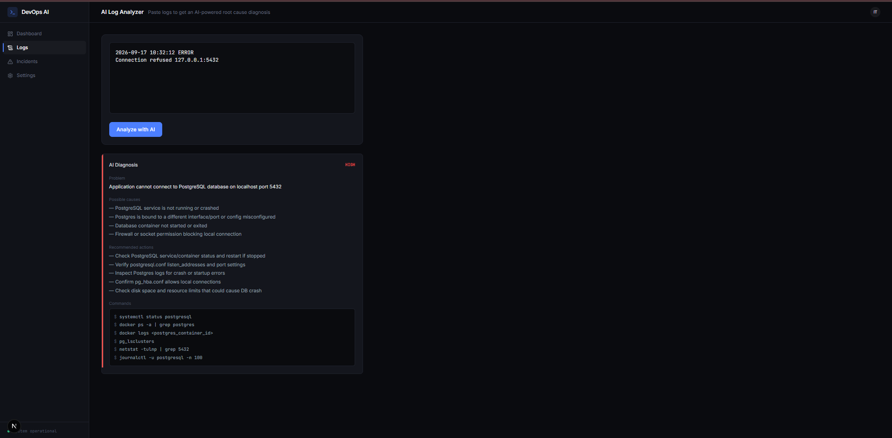
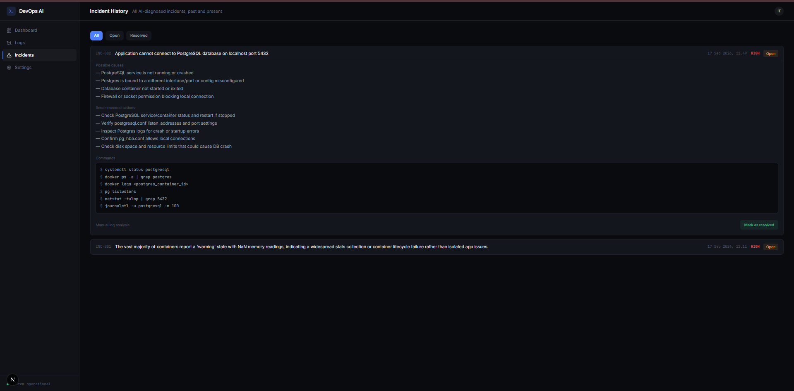
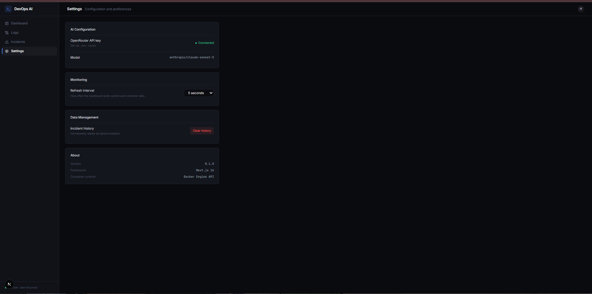

# 🧠 DevOps AI Copilot

AI-powered infrastructure monitoring and troubleshooting assistant.

DevOps AI Copilot monitors server metrics and Docker containers in real time, then uses an LLM to analyze infrastructure state, diagnose incidents, and recommend remediation steps — similar to how an AI-assisted DevOps monitoring tool would work.


## 🚀 Why I Built This

Most "AI + API" portfolio projects are essentially chat wrappers around an LLM.

This project takes a different approach: it collects **real infrastructure state** first — including CPU, memory, disk usage, Docker container status, and container metrics — then provides that structured context to an LLM for troubleshooting and root-cause analysis.

The goal is to demonstrate how AI can be integrated into an actual **monitoring and observability workflow**, rather than simply building a chatbot.

## ✨ Features

- 📊 **Real-time System Metrics** — CPU, memory, and disk usage collected directly from the host system.
- 🐳 **Docker Container Monitoring** — live container status, CPU usage, and memory usage through the Docker Engine API.
- 🤖 **AI Log Analyzer** — paste raw infrastructure logs and receive a structured diagnosis including severity, possible causes, recommendations, and commands.
- 🚨 **Automatic Incident Detection** — detects unhealthy or restarting containers and provides one-click AI diagnosis.
- 📁 **Incident History** — stores AI-generated diagnoses and allows incidents to be tracked and resolved.
- 🐋 **Fully Containerized** — the application includes a multi-stage Dockerfile and Docker Compose configuration.

## 🏗️ Architecture

```text
                         ┌──────────────────────┐
                         │    Web Dashboard     │
                         │       Next.js        │
                         └──────────┬───────────┘
                                    │
                    ┌───────────────┼───────────────┐
                    ↓               ↓               ↓
             ┌────────────┐  ┌────────────┐  ┌───────────────┐
             │   Server   │  │   Docker   │  │ Log Analyzer  │
             │   Status   │  │   Metrics  │  │ Manual Input  │
             └──────┬─────┘  └──────┬─────┘  └───────┬───────┘
                    │               │                │
                    └───────────────┼────────────────┘
                                    ↓
                         ┌──────────────────────┐
                         │      AI Engine       │
                         │     OpenRouter       │
                         │    Claude Sonnet     │
                         └──────────┬───────────┘
                                    ↓
                         ┌──────────────────────┐
                         │ Structured Diagnosis │
                         │                      │
                         │ • Severity           │
                         │ • Problem / Cause    │
                         │ • Recommendations    │
                         │ • Commands           │
                         └──────────┬───────────┘
                                    ↓
                         ┌──────────────────────┐
                         │   Incident History   │
                         │     JSON Store       │
                         └──────────────────────┘
```

### Data Flow

```text
System Metrics ────────┐
                       │
Docker Container State ├──→ AI Engine ──→ Diagnosis
                       │                       │
Infrastructure Logs ──┘                       ↓
                                        Incident History
```

## 🛠️ Tech Stack

| Layer | Technology |
|---|---|
| Frontend | Next.js 16, App Router |
| Styling | Tailwind CSS v4 |
| Backend | Next.js API Routes, Node.js |
| AI | OpenRouter API |
| System Monitoring | `systeminformation` |
| Container Monitoring | `dockerode` |
| Storage | JSON file store |
| Infrastructure | Docker, Docker Compose |

## 📸 Screenshots

### Dashboard — Real-time Metrics & Container Health


### AI Log Analyzer — Structured Root-Cause Diagnosis


### Automatic Incident Detection


### Settings


## 🤖 Example: AI Diagnosis Output

### Input

A Docker container is stuck in a restart loop.

### AI Output

```json
{
  "severity": "HIGH",
  "problem": "Container exits immediately with code 1 and enters an infinite restart loop due to its restart policy",
  "possibleCauses": [
    "Application command exits with a non-zero status",
    "Missing or misconfigured entrypoint or command causing immediate failure"
  ],
  "recommendations": [
    "Review the container command and entrypoint to ensure a long-running process is defined",
    "Change the restart policy to on-failure with a maximum retry count"
  ],
  "commands": [
    "docker logs broken-app",
    "docker inspect broken-app --format='{{.State.ExitCode}}'"
  ]
}
```

## 🚀 Getting Started

### Prerequisites

Make sure the following are installed:

- Node.js 20+
- Docker Desktop
- Git
- An OpenRouter API key

### 1. Clone the Repository

```bash
git clone https://github.com/jeremytempest636-netizen/devops-ai-copilot.git
cd devops-ai-copilot
```

### 2. Install Dependencies

```bash
npm install
```

### 3. Configure Environment Variables

Create a `.env.local` file in the project root:

```env
OPENROUTER_API_KEY=your_openrouter_api_key
```

Never commit `.env.local` to Git.

### 4. Start the Development Server

```bash
npm run dev
```

Open:

```text
http://localhost:3000
```

The main dashboard is available at:

```text
http://localhost:3000/dashboard
```

## 🐳 Running with Docker

Build and start the application using Docker Compose:

```bash
docker compose --env-file .env.local up --build
```

To run in detached mode:

```bash
docker compose --env-file .env.local up --build -d
```

To stop the containers:

```bash
docker compose down
```

## 🔐 Environment Variables

| Variable | Description |
|---|---|
| `OPENROUTER_API_KEY` | API key used to access the OpenRouter LLM API |

## 🧩 Technical Challenges & Solutions

### 1. Calculating Docker CPU Usage

Docker's CPU statistics are provided as cumulative CPU usage values rather than a direct percentage.

The application calculates CPU utilization by comparing the current CPU statistics with the previous CPU statistics (`precpu_stats`) to derive a real-time CPU percentage.

### 2. Structured AI Output Reliability

LLMs can sometimes return JSON wrapped inside Markdown code fences even when instructed to return raw JSON.

The application includes a JSON sanitization and parsing step that removes code fences before parsing the response.

If the returned content is still invalid, the application returns a clear parsing error.

### 3. Cross-Platform Docker Socket Access

Docker uses different connection mechanisms depending on the operating system.

- **Windows:** Docker Engine is accessed through a named pipe.
- **Linux:** Docker Engine is accessed through `/var/run/docker.sock`.

The application handles the Docker connection based on the runtime environment so the same codebase can work during local development and inside a Linux-based Docker container.

### 4. Monitoring Docker from Inside Docker

The application can run inside a Docker container while still monitoring Docker containers on the host.

This is achieved by mounting the Docker socket:

```text
/var/run/docker.sock:/var/run/docker.sock
```

This allows the application to communicate with the host Docker Engine.

## 🔮 Future Improvements

- [ ] Replace JSON file storage with PostgreSQL
- [ ] Add Kubernetes pod monitoring
- [ ] Integrate Prometheus + Grafana
- [ ] Add Slack and email notifications for HIGH/CRITICAL incidents
- [ ] Support multi-server monitoring with agents
- [ ] Add a Command Assistant grounded in live infrastructure state
- [ ] Add authentication and role-based access control
- [ ] Add configurable monitoring thresholds
- [ ] Add incident severity filtering and search

## 📂 Project Structure

```text
devops-ai-copilot/
│
├── src/
│   ├── app/
│   │   ├── api/
│   │   │   ├── analyze/
│   │   │   ├── docker/
│   │   │   ├── incidents/
│   │   │   ├── metrics/
│   │   │   └── settings/
│   │   │
│   │   ├── dashboard/
│   │   ├── incidents/
│   │   ├── logs/
│   │   ├── settings/
│   │   ├── globals.css
│   │   ├── layout.js
│   │   └── page.js
│   │
│   ├── components/
│   │   ├── AIResponse.js
│   │   ├── ContainerTable.js
│   │   ├── Header.js
│   │   ├── IncidentCard.js
│   │   ├── MetricCard.js
│   │   └── Sidebar.js
│   │
│   └── lib/
│       ├── ai.js
│       ├── docker.js
│       ├── incidentStore.js
│       └── metrics.js
│
├── data/
│   └── incidents.json
│
├── docs/
│   └── screenshots/
│
├── Dockerfile
├── docker-compose.yml
├── package.json
└── README.md
```

## 📌 Project Status

**MVP — Functional**

The current version provides:

- Real-time infrastructure metrics
- Docker container monitoring
- AI-powered log analysis
- Automatic incident detection
- Structured AI diagnosis
- Incident history
- Docker containerization

The architecture is designed so the JSON storage layer can later be replaced with a production database such as PostgreSQL.

## 📄 License

MIT License

## 👨‍💻 Author

Built by **Enrogel Jeremy Sibarani**

GitHub: https://github.com/jeremytempest636-netizen

LinkedIn: https://www.linkedin.com/in/enrogel-jeremy-sibarani-1bba13389
