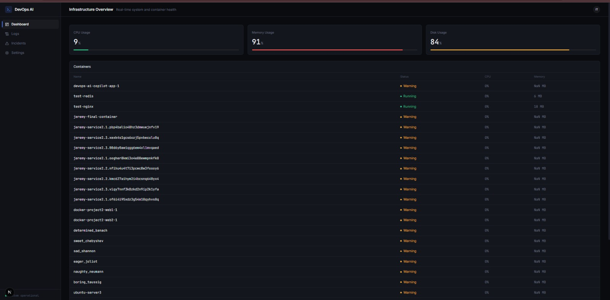

# 🧠 DevOps AI Copilot

AI-powered infrastructure monitoring and troubleshooting assistant.

DevOps AI Copilot monitors server metrics and Docker containers in real time, then uses an LLM to analyze infrastructure state, diagnose incidents, and recommend remediation steps — similar to how an AI-assisted DevOps monitoring tool would work.



## 🚀 Why I Built This

Most "AI + API" portfolio projects are essentially chat wrappers around an LLM.

This project takes a different approach: it collects **real infrastructure state** first — including CPU, memory, disk usage, Docker container status, and container metrics — then provides that structured context to an LLM for troubleshooting and root-cause analysis.

The goal is to demonstrate how AI can be integrated into an actual **monitoring and observability workflow**, rather than simply building a chatbot.

## ✨ Features

- 📊 **Real-time System Metrics** — CPU, memory, and disk usage collected directly from the host system.
- 🐳 **Docker Container Monitoring** — live container status, CPU usage, and memory usage through the Docker Engine API.
- 🤖 **AI Log Analyzer** — paste raw infrastructure logs and receive a structured diagnosis including severity, possible causes, recommendations, and commands.
- 🚨 **Automatic Incident Detection** — detects unhealthy or restarting containers and provides one-click AI diagnosis.
- 📁 **Incident History** — stores AI-generated diagnoses and allows incidents to be tracked and resolved.
- 🐋 **Fully Containerized** — the application includes a multi-stage Dockerfile and Docker Compose configuration.

## 🏗️ Architecture

```text
                         ┌──────────────────────┐
                         │    Web Dashboard     │
                         │       Next.js        │
                         └──────────┬───────────┘
                                    │
                    ┌───────────────┼───────────────┐
                    ↓               ↓               ↓
             ┌────────────┐  ┌────────────┐  ┌───────────────┐
             │   Server   │  │   Docker   │  │ Log Analyzer  │
             │   Status   │  │   Metrics  │  │ Manual Input  │
             └──────┬─────┘  └──────┬─────┘  └───────┬───────┘
                    │               │                │
                    └───────────────┼────────────────┘
                                    ↓
                         ┌──────────────────────┐
                         │      AI Engine       │
                         │     OpenRouter       │
                         │    Claude Sonnet     │
                         └──────────┬───────────┘
                                    ↓
                         ┌──────────────────────┐
                         │ Structured Diagnosis │
                         │                      │
                         │ • Severity           │
                         │ • Problem / Cause    │
                         │ • Recommendations    │
                         │ • Commands           │
                         └──────────┬───────────┘
                                    ↓
                         ┌──────────────────────┐
                         │   Incident History   │
                         │     JSON Store       │
                         └──────────────────────┘